# FND-009 wake on intent implementation plan

## Feature overview

- Problem: an existing Workspace Machine can be stopped when a person begins composing. Today `WorkspaceLifecycle.verify_workspace_ready` treats that state as unavailable, and the ordinary execution path records work without requesting a restart. The submitted message therefore waits for an out-of-band activation instead of using the composing lead time.
- Target users: people returning to an existing Ally after its shared Workspace runtime idles; operators need bounded cost, truthful readiness, and a prompt path that remains authoritative.
- Approved outcome: the first non-whitespace composer edit sends one privacy-safe `composing_started` intent through Interface and Cloud. Foundry wakes only the recorded existing Machine, coalesces every Ally in the Workspace onto one operation, and reports `ready` only after the current runtime boot authenticates to Hermes, completes startup profile reconciliation, and posts a fresh readiness receipt. Message submission never waits for or depends on speculation.
- Source of truth: `docs/plans/fnd-009-wake-on-intent-brief.md`; Nabu `projects/allies/planning/fnd-009-wake-on-intent.md`, `engineering/specs/foundry-continuity-layer.md`, `engineering/specs/conversation-and-streaming.md`, and `engineering/decisions/decision-log.md`; repository code and operational documentation at the baseline below.

### Frozen implementation baseline

| Repository | Branch and baseline | Current seams this plan extends |
| --- | --- | --- |
| Foundry | `ft/fnd-009-wake-on-intent` from `origin/dev` at `f689f0250561644d168e7ec799482ac1f1bced2e` | `Workspace`, `Execution`, `Attempt`, and `Lease`; `WorkspaceLifecycle` and `WorkspaceProvider`; runtime authentication, profile reconciliation, execution claim, `publish_event_deliveries`, Docker/Gunicorn topology |
| Cloud | `ft/fnd-009-wake-on-intent` from `origin/dev` at `2f4953dddc113ddf48e322267dc5998bcd0cfe10` | Ally/Workspace authorization, CSRF/session helpers, `check_rate_limit`, `allies.gateways.foundry`, durable message dispatch, Gunicorn/Celery/Redis topology |
| Interface | `web/ft/fnd-009-wake-on-intent` stacked on PR #18 head `web/dev/figma-chat-ui` at `52390d0fad0d68505111c4f5251245f95db8da9d` | `ConversationPane` composer, generated OpenAPI client, browser CSRF transport, Vitest/Playwright infrastructure |

The prerequisite execution, activity, streaming, profile-reconciliation, and composer paths are present at these commits. Phase 0 is therefore an evidence checkpoint, not an integration project. Unrelated worktrees and changes remain untouched.

## User stories

1. As a returning user, I want the existing shared runtime to begin waking when I enter meaningful text so less cold-start time remains after I send.
2. As a user, I want send to behave exactly as it does today when the intent is missing, disabled, throttled, timed out, or failed.
3. As an operator, I want one Workspace-scoped start, current-boot readiness, bounded idle stop, and content-free evidence so latency and false-wake cost can be measured safely.

## Scope

### In scope

- `composing_started` only, emitted once per Ally conversation view on the first non-whitespace edit.
- Strict Interface-to-Cloud, Cloud-to-Foundry, and runtime-to-Foundry contracts.
- Foundry persistence for two-minute intent eligibility and ten-minute idempotency retention.
- An existing-Machine power lifecycle that uses the recorded app, volume, Machine, generation, provider ownership checks, and the current Workspace lifecycle claim.
- One speculative provider start per Workspace per five minutes, no more than 30 accepted intent requests per Workspace per minute, and 20 browser requests per authenticated user per minute.
- A ten-minute default composing keep-warm period, configurable in seconds; epoch-, generation-, and boot-fenced readiness with a bounded heartbeat and freshness window.
- Bounded wake, readiness reconciliation, retention cleanup, and idle-stop passes inside the existing Foundry event-publisher process.
- A prompt-triggered, cooldown-exempt wake request created with normal `Execution` acceptance.
- A repeatable Dockerized fake-provider proof and a second bounded proof-owned Fly smoke, both using local Foundry/Cloud/Interface control planes and sanitized evidence.

### Out of scope

- `conversation_opened`, its 750 ms dwell experiment, or any focus-only signal.
- First Machine, app, or volume provisioning; Machine replacement; credential rotation; or another volume writer from speculation.
- Creating an `Execution`, `Attempt`, `Lease`, Hermes session, conversation event, or message from a runtime intent.
- Direct Interface access to Foundry, Fly, Hermes, runtime addresses, or credentials.
- New queues, schedulers, services, frameworks, user-visible readiness UI, SSE changes, or per-Ally Machines/timers.
- Railway/staging mutation, production enablement, or PR merge. The authorized Fly smoke may touch only exact, preflighted proof-owned resources and is not a rollout.

### Dependencies and assumptions

- Cloud's ordinary `Message` to `DispatchOutbox` to `POST /api/v1/internal/executions` flow stays authoritative. The wake addition must not alter message acceptance, reconciliation, activity projection, or SSE semantics.
- Foundry's `Workspace.machine_ref`, `volume_ref`, `fly_app_ref`, and `machine_generation` are the only provider binding used. Missing, destroyed, replacing, failed-provisioning, or ownership-mismatched bindings cannot be repaired by speculation.
- The real-provider proof has access to one preflighted proof-owned Workspace and its runtime/provider credentials. No credential, absolute path, temporary tunnel URL, private origin, or real identity is written to a plan or retained proof artifact.
- Runtime readiness defaults are 15-second heartbeat and 60-second server freshness. Both are bounded configuration; deployment validation requires heartbeat less than half the freshness window.
- `ALLIES_RUNTIME_IDLE_STOP_ENABLED` is a separate Foundry gate and defaults false. The Cloud intent kill switch controls speculation only; it cannot authorize or disable stops.
- The Railway Event Publisher currently lacks the Fly variables present on Foundry web. The implementation deliberately gives that existing process only `FLY_API_TOKEN`; power maintenance reads the persisted app/Machine binding and does not need `FLY_ORG` or `FLY_REGION`. Railway must attach the same managed secret by reference before the process is enabled. This is the sole infrastructure variable propagation in FND-009.

## Contract and shape definitions

### Function and service shapes

| Repository and location | Symbol | Contract and ownership |
| --- | --- | --- |
| Foundry `backend/runtime/services/runtime_intents.py` | `request_runtime_intent(workspace_id, intent, idempotency_key, received_at, *, now) -> RuntimeIntentReceipt` | Locks `Workspace`, exact-replays `(workspace,key)`, applies two-minute eligibility, 30/Workspace/minute and five-minute speculative-start controls, extends keep-warm only for accepted existing-Machine intent, and joins or creates one Workspace operation. It performs no provider I/O. |
| Foundry `backend/runtime/services/runtime_power.py` | `request_execution_wake_locked(workspace, *, now) -> None` | Called only while `_create_contract_execution_once` owns the Workspace lock. Marks a queued execution as the cooldown-exempt trigger for the same power operation. No network call occurs in the execution request. |
| Foundry `backend/runtime/services/runtime_power.py` | `process_runtime_wakes(*, provider, now, limit=20) -> RuntimePowerReport` | Claims bounded `requested` operations with the existing activation claim, verifies the recorded Machine/volume/generation, performs at most one eligible `start_machine`, reconciles ambiguous results by inspection, and moves to `awaiting_readiness` or a bounded failure. |
| Foundry `backend/runtime/services/runtime_readiness.py` | `accept_runtime_readiness(context, boot_id, reconciled_generation, runtime_start_epoch, *, now) -> RuntimeReadinessReceipt` | Under the Workspace lock validates the authenticated context and exact current epoch, generation, boot lifecycle, provider-start evidence, and operation state; records fresh readiness, sets coalesced intent outcomes, and returns the power operation to `idle`. Exact comparison with the monotonic current epoch rejects every old receipt without retaining historical epochs or boots. |
| Foundry `backend/runtime/services/runtime_readiness.py` | `require_current_runtime_ready_locked(workspace, context, *, now) -> None` | Called by `claim_next_execution` while it owns the Workspace lock, before any Attempt or Lease mutation. It requires the authenticated generation to equal `machine_generation` and `ready_generation`, `ready_start_epoch == runtime_start_epoch`, a non-null current `ready_boot_id`, and `runtime_last_seen_at >= now-readiness_freshness`; otherwise the direct claim route returns `409` without claiming work. |
| Foundry `backend/runtime/services/runtime_power.py` | `stop_idle_workspaces(*, provider, now, limit=20) -> RuntimePowerReport` | Selects an indexed bounded candidate set, then locks and rechecks shared-Workspace activity before claiming a stop. It uses only `WorkspaceProvider.stop_machine`/`wait_machine` and compare-and-set finalization. |
| Foundry `backend/runtime/services/runtime_power.py` | `run_runtime_maintenance(*, provider, now, limit=20) -> RuntimeMaintenanceReport` | Runs wake, expired-intent/retention cleanup, and idle-stop passes beside the existing event-delivery pass. One pass is bounded and independently observable. |
| Cloud `backend/allies/services/runtime_intents.py` | `request_runtime_intent(user, ally_id, intent, occurred_at, idempotency_key) -> RuntimeIntentResult` | Resolves Ally and active Workspace membership in one scoped query, requires `Capability.WORKSPACE_WRITE`, enforces policy/kill switch and 20/user/minute, and forwards the Workspace ID, intent, Cloud receipt time, and same key only. |
| Cloud `backend/allies/gateways/foundry.py` | `request_runtime_intent(workspace_id, intent, received_at, idempotency_key) -> RuntimeIntentReceipt` | Reuses `_foundry_origin`, bearer authentication, no-redirect behavior, five-second timeout, 64 KiB response bound, typed errors, and strict Pydantic parsing. `_request` gains an allowlisted extra-header parameter for `Idempotency-Key`; callers cannot pass `Authorization`. |
| Interface `packages/cloud-client/src/client.ts` | `requestRuntimeIntent(allyId, occurredAt, idempotencyKey, signal?) -> Promise<RuntimeIntentViewModel>` | Calls the generated route, supplies the UUID key, parses the strict result, and exposes no Foundry or provider fields. |
| Interface `apps/web/lib/session/web-session.ts` | `RunCloudOperationOptions.retryTransient?: boolean` | Keeps the adapter's operation ceiling fixed at two; there is no caller-configurable attempt count. Existing auth/CSRF replay and the opt-in transient retry consume the same remaining slot. The runtime-intent caller uses `{csrf:true,retryTransient:true}`; CSRF is fetched before the first POST and no layer outside the adapter retries. |
| Interface `apps/web/lib/allies/runtime-intent.ts` | `useComposingRuntimeIntent(allyId, requestIntent) -> { observeEdit, compositionStart, compositionEnd }` | Keeps per-mounted-view refs for sent state, composition state, stable key, and immutable body. It dispatches without awaiting and never mutates composer/send state; the session adapter owns the total two-POST budget. |

### API and transport contracts

| Boundary | Request | Successful result | Errors and retry |
| --- | --- | --- | --- |
| Browser to Cloud `POST /api/v1/allies/{ally_id}/runtime-intents` | Session + prefetched CSRF + `Idempotency-Key` UUID; strict `{ "intent": "composing_started", "occurred_at": RFC3339 }` | Existing success envelope containing only `{status}`. `200` for terminal results, `202` for `waking`. | `401`, privacy-safe `404`, `409`, `422`, `429`, `503`. There are at most two intent POSTs total: the second may be consumed by session refresh, CSRF refresh, or one opt-in timeout/network retry, never one of each. Both POSTs have identical key/body. CSRF-fetch failure makes zero POSTs. |
| Cloud to Foundry `POST /api/v1/control/workspaces/{workspace_id}/runtime-intents` | Existing Cloud service bearer + same key; strict `{ "intent": "composing_started", "received_at": RFC3339 }` | Only `{status}`, with `200` terminal or `202` `waking`. | `401`, `404`, `409`, `422`, `429`, `503`. Cloud makes one bounded call; an ambiguous response is safe because Foundry owns the key. No actor, Ally, conversation, content, credential, provider, Machine, expiry, or retry timer crosses this boundary. |
| Runtime to Foundry `POST /api/v1/runtime/readiness` | Current generation bearer; strict `{ "boot_id": UUID, "reconciled_generation": positive-int, "runtime_start_epoch": nonnegative-int }` | `200 {"status":"ready","generation":N,"runtime_start_epoch":E,"accepted_at":RFC3339}` | `401` credential, `409` stale/replaced epoch, generation, boot, or wrong power state, `422` malformed. Runtime retries boundedly; it never claims work before its first receipt succeeds. |

The bounded result vocabulary is `disabled`, `already_ready`, `waking`, `ready`, `first_provision_required`, `rate_limited`, and `failed`. `disabled` is Cloud-owned. Foundry returns `first_provision_required` without provisioning when the binding is absent, and `failed` without exposing provider detail. Success bodies contain only `status`; expiry/cooldown calculations stay server-side, and no retry-after value is persisted or propagated through the success DTOs. Existing generic rate-limit response headers may remain at the rejecting boundary, but Cloud does not forward them and Interface does not schedule from them.

Representative browser request:

```json
{
  "intent": "composing_started",
  "occurred_at": "2026-09-04T12:00:00.000Z"
}
```

Representative Cloud-to-Foundry request:

```json
{
  "intent": "composing_started",
  "received_at": "2026-09-04T12:00:00.120Z"
}
```

Representative runtime readiness request:

```json
{
  "boot_id": "00000000-0000-4000-8000-000000000009",
  "reconciled_generation": 7,
  "runtime_start_epoch": 12
}
```

`occurred_at` is validated but not forwarded. Foundry eligibility starts at the Cloud server receipt, so client clock skew cannot lengthen the window. Idempotency equivalence is the Workspace plus key plus intent type; the server receipt time is metadata and does not make an exact-key retry conflict.

### Schema and data shapes

| Schema or model | Exact fields | Constraints, indexes, and migration behavior |
| --- | --- | --- |
| Foundry `RuntimeIntent` in `backend/runtime/models.py` | UUID `id`; `workspace` FK; UUID `idempotency_key`; `intent_type`; `received_at`; `expires_at`; `delete_after`; `outcome`; UUID `coalesced_operation_id`; timestamps | Unique `(workspace,idempotency_key)`; checks for the closed enums and `received_at < expires_at <= delete_after`; only the demonstrated hot-path indexes `(workspace,received_at)` for the quota window and `(delete_after)` for cleanup. `expires_at=received_at+120s`; `delete_after=received_at+600s`. The row contains no retry timer, user, Ally, conversation, draft, provider response, Machine ID, address, or credential. |
| Foundry `Workspace` additions | `runtime_operation_id`; `runtime_operation_state`; `runtime_operation_trigger`; `runtime_operation_requested_at`; non-null `runtime_start_epoch` default `0`; `ready_generation`; `ready_start_epoch`; `ready_boot_id`; `ready_at`; `runtime_last_seen_at`; `speculative_keep_warm_until`; `last_speculative_start_at` | Closed in-flight states `idle\|requested\|starting\|awaiting_readiness\|stopping`; there are no terminal `ready` or `failed` power states. Success/failure returns the operation to `idle`, clears active operation metadata, and leaves durable truth in current readiness fields and each `RuntimeIntent.outcome`; stop failures use existing safe observability. Trigger is `speculative\|execution`. Existing activation claim fields are the provider-I/O mutex. Under the Workspace lock every provider start or stop advances the durable monotonic epoch and clears current readiness before I/O. Exact current-epoch comparison rejects delayed same-generation receipts without historical fields. Add only wake and idle candidate indexes `(runtime_operation_state,runtime_operation_requested_at)` and `(runtime_operation_state,speculative_keep_warm_until)`. |
| Cloud `RuntimeIntentMode` and `Workspace.runtime_intent_mode` | `off\|composing\|open`, default `off` | `open` is reserved data only; the service still emits only `composing_started`. A closed-value check is sufficient; the hot path loads one Workspace by Ally, so no policy index is added. |
| DTOs | Foundry `RuntimeIntentRequest`, `RuntimeIntentReceipt`, `RuntimeReadinessRequest`, `RuntimeReadinessReceipt`; Cloud public and gateway equivalents; Interface Zod/view model | `extra="forbid"` or strict Zod objects at the trust boundary, UUID/RFC3339 parsing, closed status enums, bounded nullable retry. Unknown/content-bearing fields fail rather than being ignored. |

Generate and inspect migrations rather than hand-writing them:

- Foundry `backend/runtime/migrations/0015_runtime_intent_and_readiness.py` from `make migrations APP=runtime MIGRATION_NAME=runtime_intent_and_readiness`.
- Cloud `backend/workspaces/migrations/0002_workspace_runtime_intent_mode.py` from `make migrations APP=workspaces MIGRATION_NAME=workspace_runtime_intent_mode`.
- Both are additive and default-safe. Existing Workspace rows receive epoch `0`, null current readiness, and null keep-warm; Cloud policy begins `off`. Null legacy keep-warm rows are never idle-stop candidates. Rollback first disables Cloud forwarding and the Foundry idle gate, drains/halts power maintenance, then reverses Cloud and Foundry migrations only while no new binary reads the columns.

### State and concurrency contracts

```mermaid
stateDiagram-v2
    [*] --> idle
    idle --> requested: eligible intent or queued execution
    requested --> starting: claim; advance epoch; clear readiness; start
    starting --> awaiting_readiness: recorded Machine is started
    awaiting_readiness --> idle: receipt; readiness and intent outcome are truth
    requested --> idle: missing, conflict, expiry, or provider failure
    starting --> idle: bounded start/reconciliation failure
    idle --> stopping: idle gate on; explicit deadline expired; no activity
    stopping --> idle: recorded Machine confirmed stopped
    stopping --> requested: newer execution cancels or follows stop
```



Lock and provider ownership rules:

1. Every state decision begins with `Workspace.objects.select_for_update()`. Exact intent replay is checked before quota counts. The Workspace-minute query counts only new keys in the prior 60 seconds.
2. The first eligible request creates `runtime_operation_id`; later Ally intents attach that UUID. A prompt can upgrade an in-flight speculative `requested` operation to trigger `execution`; after a prior terminal failure it creates a new operation and bypasses speculative TTL, rate, and five-minute start controls. Terminal success/failure sets coalesced intent outcomes, clears active operation metadata, and returns the power state to `idle`; readiness fields, not a duplicate `ready` state, answer whether the runtime can claim.
3. The event-publisher claims provider work by compare-and-set on operation UUID plus the existing `activation_claim_token`. It commits before network I/O. Provider calls never run inside a database transaction.
4. Immediately before every `WorkspaceProvider.start_machine` or `stop_machine`, re-lock and confirm the same operation/claim, current recorded binding, provisioning phase, and budget. Still under that lock, checked-increment `runtime_start_epoch` and clear `ready_generation`, `ready_start_epoch`, `ready_boot_id`, `ready_at`, and `runtime_last_seen_at`; commit before provider I/O. Epoch overflow fails closed without a provider call. A speculative start also stamps `last_speculative_start_at`. After timeout or claim expiry, inspect the exact recorded Machine first; never blind-retry or create/replace it.
5. Startup reconciliation returns both `machine_generation` and current `runtime_start_epoch`; `FoundryWorker` captures a process boot UUID and reports all three after authenticated Hermes health and forced profile reconciliation. `accept_runtime_readiness` locks the Workspace and accepts only an exact current epoch and generation. It may establish the current boot only after the matching start lifecycle; thereafter only that boot may refresh the heartbeat. Any lower, future, replaced, or otherwise mismatched epoch/boot gets `409`, including a delayed old receipt after clear/start in the same Machine generation. Because epochs never decrease and acceptance is equality-only, no prior epoch/boot columns or history table is needed.
6. Readiness is server-authoritative at work claim, not a worker convention. `claims.py::claim_next_execution` calls `require_current_runtime_ready_locked` under its existing Workspace lock and before creating or mutating an Attempt or Lease. The authenticated context generation must equal both current `machine_generation` and `ready_generation`; `ready_start_epoch` must equal current `runtime_start_epoch`; `ready_boot_id` and `runtime_last_seen_at` must be non-null; and the sighting must be within 60 seconds. Failed checks return `409` from the direct runtime API and leave the execution queued. Heartbeats repeat at most every 15 seconds; credential/generation fencing stops the worker.
7. Idle selection is entirely disabled unless `ALLIES_RUNTIME_IDLE_STOP_ENABLED=true`. When enabled, its bounded indexed query requires an explicit non-null `speculative_keep_warm_until <= now`; null legacy rows are ineligible. Under the Workspace lock it rejects any `Execution` in `queued|running`, `Attempt` in `queued|leased|running`, `Lease` in `active|stopping`, current provisioning, unexpired/missing keep-warm, or newer lifecycle operation. It claims `stopping`, commits, re-locks immediately before the epoch advance/provider mutation, and repeats the checks.
8. Execution acceptance already locks the Workspace in `_create_contract_execution_once`. On new or duplicate queued work it invalidates a not-yet-mutated stop claim, establishes an explicit normal keep-warm deadline, and marks an `execution` wake. If work arrives after the final stop check, compare-and-set finalization cannot overwrite the newer operation; the next bounded wake-first pass restarts the recorded Machine. Thus no execution is lost even at the external-I/O race boundary.
9. Each publisher iteration runs `process_runtime_wakes` first in its own caught/reportable failure boundary. It then publishes at most one pending event (`publish_pending_event_deliveries(limit=1)`), limiting the existing five-second delivery timeout to one per iteration; cleanup and gated idle work run last with their own strict batch/time budgets. With the supervised one-second interval, healthy local database/process scheduling, and an immediately available provider call, a committed queued-execution wake begins `start_machine` within seven seconds even if every event delivery times out. Wake failure never suppresses delivery, and delivery/cleanup/idle failure never suppresses the next wake pass.

### Frontend interaction shape

`ConversationPane` keeps the existing draft/send flow. The textarea handlers call the feature-local observer after updating `draftRef`; they do not await it. Whitespace-only values do nothing. During IME composition, `onChange` records the value but emission waits for `onCompositionEnd`, which re-evaluates the final value. A `sentRef` is set before starting I/O, so React Strict Mode effects or concurrent callbacks cannot double-send. The UUID, request timestamp, and serialized body are created once. Before the first intent POST the existing session adapter resolves CSRF; one shared counter allows at most two POST calls total. A `401` refresh, CSRF rejection refresh, or transient network/timeout can consume the final attempt, but no sequence gets a third. Remounting a different conversation view creates fresh state; no Zustand/query cache, cross-tab protocol, loading state, announcement, or submit dependency is added.

## Phases

### Phase 0: freeze contracts and measurement points

- Confirm the three SHAs above, clean feature worktrees, ordinary prompt flow, and generated Cloud OpenAPI baseline.
- Add a shared, content-free contract fixture in Foundry `docs/contracts/fnd-009-runtime-intent-v1.json`, copied byte-for-byte into Cloud `backend/allies/tests/fixtures/` and exercised in both contract suites. Interface consumes regenerated OpenAPI rather than a third hand-maintained wire type.
- Fix measurement names before behavior changes: Cloud receipt, Foundry intent accepted, provider start requested/observed, readiness accepted, execution accepted/claimed, first normalized visible activity/token, terminal, and stop observed. Reuse current wide-event builders and allowlists; record trigger/outcome/duration/warm-at-submit, never content or credentials.
- Exit: an ordinary prompt still reaches execution/activity streaming at the baselines, and fixture parsers agree. No latency claim is made.

### Phase 1: add Foundry intent, power, and readiness authority

- Update `backend/runtime/models.py`, generated migration `0015`, `api/schemas.py`, and `api/register.py` with the strict control and runtime routes.
- Add `services/runtime_intents.py`, `services/runtime_power.py`, and `services/runtime_readiness.py`. Reuse `WorkspaceProvider`, `FlyProvider`, `MachineState`, deterministic ownership metadata, retry exceptions, runtime auth, and wide events. Do not call the activation management command from the new endpoint.
- Extend `services/executions.py::_create_contract_execution_once` with the pure locked prompt-wake marker for new and duplicate queued executions. Extend `services/claims.py::claim_next_execution` with the locked server-authoritative readiness guard before Attempt/Lease mutation.
- Extend `management/commands/publish_event_deliveries.py::_run_once` into explicit wake-first, one-event, and cleanup/gated-idle stages, each caught and reported independently. Preserve the command name and watch bounds so Docker/Railway process topology does not add or rename a service.
- Add a narrow provider factory that reads `FLY_API_TOKEN` for start/inspect/stop and otherwise uses the production `FlyProvider` defaults. It must not read organization, region, image, profile, or provisioning settings. A custom `base_url` is accepted only behind the explicit debug/proof conjunction defined in Phase 4; it fails configuration closed everywhere else. Keep event delivery running if power configuration is unavailable and report only a safe counter.
- Extend `runtime/allies_runtime/foundry.py` with `FoundryClient.report_readiness`, an epoch-and-generation-bearing reconciliation snapshot, boot UUID ownership in `FoundryWorker`, and the bounded readiness loop. Update `composition.py` without adding dependencies.
- Add default-off `ALLIES_RUNTIME_IDLE_STOP_ENABLED`, keep it independent of the Cloud speculation kill switch, and require explicit non-null keep-warm for every candidate.
- Exit: unit/PostgreSQL race tests show one provider start, prompt bypass, epoch/generation/boot readiness enforced on direct claims, wake start within seven seconds under saturated delivery timeouts, gated bounded idle stop, and no speculative runtime truth creation.

### Phase 2: add Cloud product policy and gateway

- Add `Workspace.runtime_intent_mode` and migration `0002`; add bounded settings `ALLIES_RUNTIME_INTENT_ENABLED=false`, user limit `20`, and period `60`.
- Add strict schemas/controller route in `backend/allies/api/schemas.py`, `controllers.py`, and `register.py`; add `backend/allies/services/runtime_intents.py` and typed exceptions.
- Extend `backend/allies/gateways/foundry.py` rather than adding a client. Reuse service token, origin validation, timeout, response bound, and error taxonomy. Forward only path Workspace ID, allowed intent, server receipt time, and the same key.
- Reuse `check_rate_limit(scope="runtime-intent-user", identity=str(user.id), limit=20, period=60)`. Policy/kill-switch suppression returns `disabled` without calling Foundry; all message paths ignore these settings.
- Regenerate Cloud OpenAPI and add route/schema/gateway/authorization/tenant-isolation tests.
- Exit: foreign Ally access is indistinguishable from missing, policy `off` and kill switch call no gateway, `open` behaves like composing without emitting open intent, and request/log captures contain no content.

### Phase 3: wire Interface first-edit intent

- Regenerate `packages/cloud-client/openapi/allies-cloud-0.1.0.json` from the Phase 2 schema, then update `src/mappers/allies.ts`, `src/client.ts`, and client tests with the new result type/method.
- Refactor the existing `apps/web/lib/session/web-session.ts` retry branches behind one local fixed-two operation counter and optional `retryTransient=false`, keeping existing auth/CSRF replay behavior for other callers without exposing an attempt-count option. Prefetch CSRF before attempt one. Add focused adapter tests before wiring `apps/web/lib/allies/runtime-intent.ts` into only the textarea callbacks in `apps/web/app/home/home-workspace.tsx`.
- Cover first meaningful key input, paste, speech-style input, IME, whitespace-to-text, React Strict Mode, navigation/remount, first network/timeout retry, `401 -> refresh -> network`, `csrf_rejected -> refresh -> timeout`, CSRF-fetch failure, HTTP failure, and immediate submit. Assert zero POSTs on CSRF-fetch failure, never more than two otherwise, identical key/body across both attempts, and that `sendMessageContent` is never gated.
- Exit: one view emits at most one logical intent with at most two total POST attempts inclusive of all replay causes, while existing send/activity UI is unchanged.

### Phase 4: prove the complete topology

#### Mandatory repeatable fake-provider gate

- Add `compose.fnd009.yaml`, small deterministic seed commands, one test-only HTTP simulator process, `apps/web/e2e/wake-on-intent.spec.ts`, and `apps/web/playwright.fnd009.config.ts`. Foundry web and publisher still instantiate the production `FlyProvider`, pointed through its existing `base_url` constructor seam at the simulator's narrow Fly Machines API. The one simulator process exclusively owns in-memory Machine state, call counts, generation, and epoch and exposes an authenticated read-only snapshot to proof assertions; there is no second provider implementation, shared JSON writer, or cross-process file lock.
- Add `ALLIES_FLY_API_BASE_URL` only for this proof seam. Startup accepts it only when both `DJANGO_DEBUG=true` and explicit `ALLIES_RUNTIME_POWER_PROOF_ENABLED=true`; a set override outside that conjunction raises a configuration error before serving or running maintenance. Production and the real-Fly smoke leave it unset and use the `FlyProvider` default endpoint.
- Use UUIDv5 values derived from the constant namespace and labels `fnd009-workspace`, `fnd009-user`, `fnd009-ally-a`, `fnd009-ally-b`, and `fnd009-conversation-*`. Seed isolated empty Foundry and Cloud databases, current runtime credentials/profile bindings, two Allies sharing one Workspace, mode `composing`, and an explicit short keep-warm deadline. The browser signs in through Cloud's existing fake-provider public auth flow with the deterministic synthetic subject, obtains its session and CSRF normally, and never receives injected cookies.
- Start Foundry migrate, production-entrypoint/Gunicorn web, and event-publisher containers; start Cloud migrate, Gunicorn web, Celery worker, and Celery beat containers; start local Interface and Playwright. On the simulated Fly start call, that same state-owning simulator process performs the seeded runtime auth/profile-reconciliation contract, posts readiness with the current epoch/generation/boot, claims through the public runtime API, and emits ordinary ordered activity so Playwright verifies SSE and the visible response rather than mutating database state directly.
- Drive `stopped -> composing wake -> ready -> message response -> idle -> stopped -> prompt wake -> second response` without refresh, and prove a queued/leased second Ally blocks shared-Workspace stop. The simulator snapshot proves one start per operation, epoch advancement, and exact stop/start order; persisted database reads prove intent, execution, readiness, and claim state.
- A small `scripts/prove_fnd009.py` only validates preconditions, creates an explicit unique Compose project/network name, invokes Compose/seed/Playwright commands, captures a sanitized report, and performs cleanup; it does not reimplement lifecycle or polling. Preflight requires Docker/Compose, free configured ports, clean isolated database/volume names, local-only origins, fake-provider selection, and built images. On success or failure it captures sanitized logs/state, runs `docker compose -p <exact-run-id> down --volumes`, removes only the exact recorded proof network, verifies those exact containers/volumes/network are absent, and exits nonzero if proof or cleanup fails. No wildcard or guessed-resource deletion is allowed.
- Freeze command parity deliberately: the bounded local proof publisher is `uv run --no-sync python manage.py publish_event_deliveries --watch --interval 1 --max-runs 1440`; Railway remains its current supervised unbounded `uv run --no-sync python manage.py publish_event_deliveries --watch --interval 1`.

#### Mandatory bounded real-Fly smoke

- Run only after the fake-provider gate. Reuse the same Dockerized local Foundry/Cloud and local Interface, synthetic seed/browser-auth path, Playwright story, existing `activate_fly_workspace`/`prove_machine_continuity` ownership checks, and a small bounded proof-script mode. Do not contact or mutate Railway/staging.
- Preflight requires a clean exact manifest path for this run; an immutable feature-branch runtime image resolved and recorded by digest with its source SHA; Fly authentication; a public temporary HTTPS tunnel reaching local Foundry health; short proof-only keep-warm/heartbeat settings; and one proof-owned app, volume, and Machine whose exact IDs and ownership metadata are returned by the existing activation/proof commands. The tunnel URL and credentials remain process environment only and are redacted from logs/report.
- Before any start/stop, persist the exact app, volume, Machine, Workspace, generation, image digest, and initial provider state in the ignored run manifest; re-read each resource by exact ID and require proof ownership. Playwright then exercises the stopped wake/readiness/message/idle-stop/second-wake story through local Cloud and Interface. This is a bounded provider smoke, not Railway validation, rollout evidence, or a performance claim.
- Cleanup uses only IDs in that manifest: stop the exact created/resumed proof Machine if necessary, invoke the existing proof cleanup for only resources created by this run, restore any pre-existing proof-owned resource to its recorded initial state, revoke temporary runtime proof credentials, and stop/revoke the exact tunnel process. Re-read each recorded ID to verify the expected restored/absent state and verify the tunnel is unreachable. If ownership, manifest completeness, cleanup, or post-check is uncertain, make no destructive guess: stop mutations, retain the sanitized manifest/evidence, fail the gate, and require operator reconciliation. Never enumerate-and-delete or use a name prefix/wildcard.

- Phase exit: all suites, the repeatable fake-provider gate, and the bounded real-Fly smoke pass before any PR opens. Compare stopped-existing and warm timestamps on the same basis and report observations without claiming improvement from a single run.

## Acceptance criteria

1. First non-whitespace edit emits one content-free `composing_started` per mounted Ally view and no more than two total intent POSTs inclusive of 401/CSRF replay and opt-in transient retry; both use the same key/body, and IME/Strict Mode tests pass.
2. Cloud applies CSRF, session authentication, active membership/`WORKSPACE_WRITE`, strict schema, policy, kill switch, and 20/user/minute before the minimal Foundry call.
3. Foundry persists exact-key results for ten minutes, expires work eligibility after two minutes, caps new keys at 30/Workspace/minute, and attempts no more than one speculative provider start/Workspace/five minutes.
4. Concurrent Ally intents share one operation and provider start. No intent creates an execution, attempt, lease, session, event, Machine, volume, credential, or replacement writer.
5. Only the recorded existing stopped Machine can start. Missing/unprovisioned returns `first_provision_required`; missing/destroyed/conflicting bindings return a bounded failure without repair.
6. `ready` requires current provider-start evidence plus a fresh receipt matching the server-owned current start epoch, generation, and non-null boot after authenticated Hermes health and reconciliation. `claim_next_execution` rechecks that truth under lock before any Attempt/Lease mutation; stale, absent, old-epoch, and replaced-boot receipts cannot claim through the direct API. No historical epoch/boot state is required.
7. Idle stop requires the separate default-off Foundry idle gate, an explicit expired non-null keep-warm deadline, no queued/active execution or attempt, and no unresolved lease under the locked recheck. Legacy null rows never stop merely by enabling the gate; activity for any Ally prevents the decision.
8. New and replayed queued executions request a cooldown-exempt wake. Intent absence, disablement, throttling, expiry, timeout, or failure never changes message admission or eventual execution.
9. Each publisher iteration attempts bounded wake work before at most one event delivery. A saturated five-second delivery timeout stream cannot delay a committed queued-execution start invocation beyond seven seconds under the declared healthy local conditions; stage failures are independently reported.
10. Complete Foundry, runtime, Cloud, and Interface validation passes, followed by both the repeatable fake-provider proof and bounded proof-owned real-Fly smoke. Artifacts contain no private paths/origins, tunnel URLs, identities, secrets, content, or raw provider payloads.
11. No PR opens until Phase 4 passes. The resulting PRs open for review but do not merge or mutate Railway/staging in this work.

## Backend considerations

### Query optimization and N+1 prevention

- Foundry intent admission is constant-query per request: Workspace lock, exact key lookup, bounded 60-second count, and state write. It never enumerates Allies or profiles.
- Idle candidate discovery is indexed and limited; activity checks use `Exists` across `Execution`, `Attempt`, and `Lease`, followed by one locked Workspace recheck per candidate. Provider calls occur only for claimed candidates, never in an ORM iteration over related objects.
- Cloud resolves Ally, Workspace, and active membership with `select_related("workspace")` plus a membership predicate, then performs one capability check and one gateway call. Add query-count tests that remain flat as Ally/profile counts grow.
- Add only the two `RuntimeIntent` and two Workspace candidate indexes named in the schema table, backed by query-count/scale-shape tests. Do not make unconditional `EXPLAIN` inspection an implementation or PR gate; capture a PostgreSQL plan only if representative integration data or CI timing shows a regression. SQLite remains a unit-test compatibility path, not concurrency evidence.

### Detailed test matrix

| Area | Required cases |
| --- | --- |
| Foundry intent | exact duplicate, conflicting type/key, cross-Workspace key reuse, reordered delivery, 2-minute expiry, 10-minute replay then cleanup, 30/minute boundary, 5-minute start boundary, ready/already-ready/waking/first-provision/failed outcomes |
| Foundry concurrency/provider | parallel keys across multiple Allies, claim expiry, timeout after remote start, inspect-before-retry, stopped/created/started/transitional/destroyed Machine, wrong volume/ownership/generation, active activation/provisioning, no second Machine API call |
| Readiness/runtime | invalid bearer; pre-receipt direct claim; non-null current boot requirement; exact current epoch/generation match; same-boot heartbeat; freshness expiry then direct claim; start clears readiness and advances epoch; stop does likewise; delayed old same-generation/old-epoch receipt without historical fields; replaced boot receipt; future epoch; provider not started; Hermes auth/health failure; reconciliation blocked; receipt loss/retry; no Attempt/Lease mutation on `409` |
| Publisher ordering | wake failure still delivers; delivery/cleanup/idle failure does not suppress next wake; 20 pending deliveries that each take the five-second timeout with new queued execution; assert `start_machine` invocation begins within seven seconds under healthy local DB/process/provider-call conditions and only one delivery is attempted per iteration |
| Prompt and idle | prompt without intent, prompt during speculative cooldown/failure/stop, duplicate queued execution, second Ally queued/running, active/stopping lease, idle gate off, gate on with legacy null keep-warm, unexpired/expired explicit keep-warm, stop timeout, epoch advance before stop, new work before/after final recheck, CAS finalization |
| Cloud | CSRF/session failures, inactive/foreign membership, strict unknown/content field, malformed timestamp/key, off/composing/open modes, global disable, 20/minute, Foundry 200/202/401/404/409/422/429/5xx/malformed/timeout, same-key forwarding, no content in request/log/event |
| Interface | whitespace, paste, IME start/change/end, Strict Mode, repeated changes, default transient failure/no retry, opt-in first transient retry, `401 -> refresh -> network`, `csrf_rejected -> refresh -> timeout`, CSRF-prefetch failure/zero POSTs, non-retryable HTTP result, identical key/body, fixed two-total-POST ceiling with no attempt-count option, unmount, same-view send, view remount, no visible state and no wait before message send |

## Test and validation plan

- Foundry focused: `cd backend; uv run --locked pytest runtime/tests/test_runtime_intents.py runtime/tests/test_runtime_power.py runtime/tests/test_runtime_readiness.py runtime/tests/test_claims.py runtime/tests/test_event_publisher.py runtime/tests/test_api.py runtime/tests/test_cld005_contract.py`; PostgreSQL-marked concurrency cases; then `make check`, `make runtime-test`, `make lint`, and `uv run --locked --project backend python scripts/validate.py`.
- Runtime focused: `cd runtime; uv run --locked pytest tests/test_foundry.py tests/test_profile_reconciliation.py tests/test_readiness.py tests/test_composition.py`; preserve branch coverage and the current 90% runtime threshold.
- Cloud focused: `make check`; `make test APP=allies/tests`; `make test APP=workspaces/tests`; gateway/API/PostgreSQL concurrency cases; then `make test`, `make lint`, and migration apply/check. Preserve CI's auth/workspaces 90% checks.
- Interface: focused `apps/web/lib/session/web-session.test.ts` and runtime-intent/home tests; `bun run cloud:check`; `bun run typecheck`; `bun run test:run`; `bun run lint`; `bun run build:web`; `bun run bundle:mobile`; then the dedicated FND-009 Playwright config against both proof modes.
- Migration verification: apply from empty databases and baseline snapshots, run `makemigrations --check --dry-run`, inspect reverse plans, and confirm default-off Cloud plus nullable/unready Foundry behavior during rolling skew.
- Artifact verification: inspect `git diff --check` and `git diff`; compare Markdown and HTML headings, tables, thresholds, commands, contracts, risks, and acceptance claims; scan both for drive-letter paths, usernames, credentials, private origins, and foreign branding; audit HTML at desktop and narrow widths in light/dark browser themes.

## Docker, Railway, rollout, and PR order

- Foundry Compose remains `postgres`, separate `migrate`, production-entrypoint `foundry`, and separate `event-publisher`. The local proof command is exactly `uv run --no-sync python manage.py publish_event_deliveries --watch --interval 1 --max-runs 1440`. Railway remains supervised and unbounded exactly as current: `uv run --no-sync python manage.py publish_event_deliveries --watch --interval 1`. Add command-parity tests so neither is normalized to the other. Local Compose already applies shared proof environment to `event-publisher`; assert its resolved environment contains a non-empty provider token reference without printing it.
- Railway's Event Publisher variable list must add `FLY_API_TOKEN` as a reference to the managed Foundry web secret, not as a second literal. Do not propagate `FLY_ORG` or `FLY_REGION`: the publisher is forbidden from provisioning and uses the durable `fly_app_ref`/`machine_ref`. This copies an organization-scoped provider capability into another service, increasing the compromise surface; mitigate it with Railway secret references, least-privilege provider credentials when Fly supports the required actions, no value logging, startup presence validation, and rotation/revocation in the rollback runbook. A new internal web power-pass endpoint was rejected because it would add another credential, network failure mode, and privileged HTTP surface while the existing publisher already owns bounded maintenance work.
- Cloud Compose remains `postgres`, `redis`, separate `migrate`, Gunicorn `backend`, Celery `worker`, and Celery `beat`. No new task, queue, or service is introduced. Compare every image, working directory, concurrency, timeout, queue, and max-tasks flag with `docs/operations/railway-staging.md`; keep ignored `.railway/` operator material out of commits.
- Roll out in four ordered checkpoints: deploy additive Foundry/Cloud/Interface code with both gates off; attach the managed `FLY_API_TOKEN` reference to Railway Event Publisher and verify presence without revealing it; enable and observe wake/prompt maintenance while Cloud policy remains selectively controlled; only then explicitly enable `ALLIES_RUNTIME_IDLE_STOP_ENABLED`. Existing/null keep-warm rows stay ineligible until ordinary wake/prompt activity writes a deadline. The Cloud kill switch suppresses only new speculative intent forwarding; the Foundry idle gate alone controls stopping. Rollback first turns the idle gate off, then the Cloud speculation switch, while event delivery and prompt wake remain available.
- PR dependency order after all proof gates: (1) Foundry PR to `dev`; (2) Cloud PR to `dev`, explicitly depending on the Foundry contract PR; (3) Interface PR based on `web/dev/figma-chat-ui`/PR #18, explicitly depending on Cloud. If PR #18 merges first, rebase and retarget Interface to `dev` without changing the reviewed feature diff. Open all three for review, do not merge, and do not enable Railway/Fly.

## Risks and mitigations

| Risk | Mitigation | Rollback or fallback |
| --- | --- | --- |
| Provider `started` or stale process is mistaken for runtime readiness | Durable monotonic start epoch advanced before every start/stop, exact current epoch/generation/boot receipt, and locked freshness guard in `claim_next_execution`; equality fencing makes historical epoch/boot storage unnecessary | Return `409`/`waking`; leave execution queued with no Attempt/Lease mutation until current readiness arrives |
| Concurrent intents or a lost response duplicate provider start | Workspace operation UUID, activation claim, five-minute stamp immediately before speculative start, and inspect-before-retry | Kill switch off; preserve intent receipts for replay and allow only prompt-triggered reconciliation |
| Idle stop races new work or touches legacy rows | Separate default-off gate, explicit non-null deadline, locked `Exists` checks, repeated pre-mutation check, shared operation CAS, and execution acceptance overriding stop ownership | Turn off only the idle gate; new execution marks prompt wake and finalization cannot overwrite it |
| False wakes increase Machine time | Composing only, once/view, 2-minute eligibility, 10-minute keep-warm, 20/user/minute, 30/Workspace/minute, one speculative start/5 minutes | Set Workspace mode `off` or global forwarding off; idle maintenance reclaims eligible Machines |
| Publisher delivery backlog delays prompt wake | Wake-first stage, one five-second event attempt per iteration, independent error boundaries, and a seven-second wake-start saturation test | Disable speculation if needed; queued execution wake continues on the next supervised pass |
| Cross-repository version skew | Foundry-first strict v1 fixture, additive/default-safe migrations, Cloud default off, regenerated Interface client | Disable forwarding; old Interface remains compatible and messages continue through existing routes |
| Event Publisher needs provider authority | Propagate only the managed `FLY_API_TOKEN` reference; keep organization/region/provisioning inputs out; validate presence without logging and document rotation | Disable Cloud forwarding and power maintenance, rotate/revoke the token, and leave event delivery running while prompt rows remain durable |
| Sensitive data appears in intent evidence | Strict content-free schemas, Cloud-only actor scope, allowlisted wide events, bounded receipts, sanitization tests | Disable endpoint/events, delete expired ten-minute intent rows through the normal bounded cleanup |
| Proof mutates unrelated Fly resources or is mistaken for rollout evidence | Exact proof-owned ID manifest, ownership recheck before mutation, immutable image digest, no wildcard cleanup, local control planes only, and explicit scope labeling | Stop on ambiguity, retain sanitized evidence, reconcile exact IDs manually; make no staging/performance claim |

Open decisions: none. The brief fixes product and architecture choices; implementation values not fixed there use the bounded defaults stated above and remain configuration, not new product behavior.
